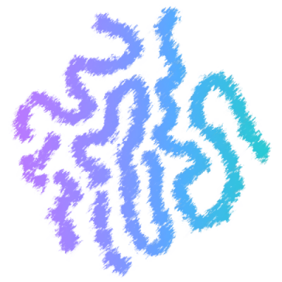

# *Recommendation-Algorithm* 


## View English Introduction
 - [Click to read English introduction.](#_Index)

## 🙏 후원 안내 (Support & Sponsor)

이 프로젝트가 도움이 되었다면, 개발 지속과 유지보수를 위해 후원을 부탁드립니다!  
여러분의 작은 응원이 오픈소스 발전에 큰 힘이 됩니다.

- [GitHub Sponsors로 후원하기](https://github.com/sponsors/여러분의_아이디)
- 또는 커피 한 잔을 보내주세요! ☕

If you find this project useful, please consider supporting it!  
Your sponsorship helps keep this project alive and motivates further development.

- [Sponsor via GitHub Sponsors](https://github.com/sponsors/your_id)
- Or just buy me a coffee! ☕

감사합니다! Thank you!

---
## Index 
- [Directory](#Directory)
- [DataSet](#DataSet)
- [Annoy 라이브러리를 활용한 벡터 유사도 최적화](#annoy-라이브러리를-활용한-벡터-유사도-최적화)
- [t-SNE를 활용한 벡터 데이터 시각화](#t-SNE를-활용한-벡터-데이터-시각화)
- [한국어 텍스트 분류를 위한 BERT 모델을 활용한 단어 필터링](#한국어-텍스트-분류를-위한-bert-모델을-활용한-단어-필터링)
- [konlpy와 googletrans를 활용한 카테고리 형태소 분석 및 번역](#konlpy와-googletrans를-활용한-카테고리-형태소-분석-및-번역)
- [Word2Vec 한국어 단어 임베딩 데이터베이스 구축](#word2vec-한국어-단어-임베딩-데이터베이스-구축)
- [의미론적 단어유사도를 활용한 카테고리/키워드 추천](#의미론적-단어유사도를-활용한-카테고리키워드-추천)
- [라이선스](#라이선스)


---
## Directory
- [`USER_CTGY`](USER_CTGY): 사용자 기반 협업필터링을 통한 카테고리 추천 알고리즘(User-based CF)
- [`USER_MODL`](USER_MODL): 콘텐츠 기반 협업필터링을 통한 묘듈별 기능 추천 알고리즘(Item-based CF)
- [`SMLR_RECO`](SMLR_RECO): 형태소 분석, 태깅 라이브러리를 이용한 의미론적 키워드, 카테고리 추천 알고리즘
  1. [`ByCTGY`](SMLR_RECO/ByCTGY): 카테고리 기반 연관 카테고리 추천 알고리즘
  2. [`ByKYWD`](SMLR_RECO/ByKYWD): 키워드 기반 연관 카테고리, 키워드 추천 알고리즘
  

---
## DataSet
1. 유저의 명시적 데이터와 카테고리/모듈 별 행동 기록을 분석한 암시적 피드백을 활용한 카테고리/모듈 벡터 데이터
   - 동적 벡터 가중치: 사용한 포인트, 더보기 요청, 검색, 30초 이상 체류, 저장/갱신 활성화, 좋아요 / 댓글
   - 정적 벡터 가중치: 모듈, 카테고리, 키워드, 연간 키워드
2. spellcheck-ko에서 제공하는 [한국어기초사전](https://krdict.korean.go.kr/), [표준국어대사전](https://stdict.korean.go.kr/), [우리말샘](https://opendict.korean.go.kr/) 기반  [한국어 맞춤법 사전](https://github.com/spellcheck-ko/hunspell-dict-ko/releases/download/0.7.92/ko-aff-dic-0.7.92.zip)
3. Facebook에서 제공하는 FastText의 300차원 벡터로 표현하여 단어의 의미적 관계를 반영한 한국어 Word2Vec 모델 [한국어 단어 벡터](https://dl.fbaipublicfiles.com/fasttext/vectors-crawl/cc.ko.300.vec.gz)
4. 네이버 카테고리를 형태소 분석하여 나눈 네이버 카테고리 말 뭉치


---
## Annoy 라이브러리를 활용한 벡터 유사도 최적화
[`Annoy`](https://github.com/spotify/annoy)와 [`Bayesian Optimization`](https://github.com/bayesian-optimization/BayesianOptimization) 라이브러리를 사용하여 벡터 유사도를 최적화 합니다.  

### 사용된 주요 기술 및 라이브러리
- **Annoy 라이브러리:** 벡터 유사도를 효율적으로 계산하고 검색하기 위한 라이브러리
- **Bayesian Optimization:** 목적 함수를 최적화하기 위한 효율적인 알고리즘
- **pandas:** 데이터 조작 및 계산 라이브러리
- **numpy:** 다차원 배열을 처리하기 위한 라이브러리
- **matplotlib:** 데이터 시각화 라이브러리

### 사용법
1. **의존성 설치:**
   ```bash
   pip install annoy pandas numpy scikit-learn bayesian-optimization matplotlib

2. **코드 실행:**
   ```bash
   python *_optimizeAnnModel.py
위 명령어를 실행하여 Annoy 라이브러리를 사용한 벡터 유사도 최적화를 수행

### 파이썬 코드 파일 (*_similarity_optimization.py)에 대한 설명
- `evaluate_n_trees(n_trees)`: Annoy 인덱스의 정확도를 최적화하기 위한 함수로, 주어진 트리 수에 대해 벡터 유사도를 계산하고 최근접 이웃들의 평균 거리를 반환
- `BayesianOptimization`: 트리 수(n_trees)를 조정하여 목적 함수(evaluate_n_trees)를 최적의 평균 거리를 탐색하며 트리 수 최적화
  

---  
## t-SNE를 활용한 벡터 데이터 시각화 
scikit-learn의 [`t-SNE`](https://github.com/scikit-learn/scikit-learn/tree/main) 알고리즘을 활용하여 벡터 데이터를 시각화 합니다.

### 사용된 주요 기술 및 라이브러리
- **t-SNE:** 고차원 데이터의 구조를 유지하면서 저차원으로 축소하여 시각화하는 데 사용되는 알고리즘
- **matplotlib:** 데이터 시각화 라이브러리
- **scikit-learn:** 머신러닝 모델 구현 라이브러리
- **pandas:** 데이터 조작 및 계산 라이브러리
- **numpy:** 다차원 배열을 처리하기 위한 라이브러리

### 사용법

1. **의존성 설치:**
   ```bash
   pip install scikit-learn matplotlib pandas numpy
2. **코드 실행:**
   ```bash 
   python visualize_vectors.py
TSNE_3D.png 및 TSNE_2D.png 이미지 파일로 2D 및 3D t-SNE 결과가 생성
  

--- 
## 한국어 텍스트 분류를 위한 BERT 모델을 활용한 단어 필터링
텍스트에서 깨끗한 단어를 필터링하기 위해 자연어 처리(NLP) 작업에 사용되는 사전 훈련된 언어 모델인 BERT 모델을 사용합니다.

### 사용된 주요 기술 및 라이브러리
- **BERT:** 양방향 트랜스포머 모델을 기반으로 한 사전 훈련된 언어 모델, Smilegate-ai에서 제공하는 [`kor_unsmile`](https://github.com/smilegate-ai/korean_unsmile_dataset) 모델을 활용
- **Hugging Face Transformers:** 다국어로 된 여러 사전 훈련 모델을 제공하는 라이브러리, 모델을 로드하고 텍스트 분류를 수행

### 사용법

1. **의존성 설치:**
   ```bash
   pip install transformers tqdm

2. **사전 훈련된 BERT 모델 및 토크나이저 다운로드:**
    ```python
    from transformers import BertForSequenceClassification, AutoTokenizer
    
    model_name = 'smilegate-ai/kor_unsmile'
    model = BertForSequenceClassification.from_pretrained(model_name)
    tokenizer = AutoTokenizer.from_pretrained(model_name)
3. **단어 필터링 수행:**
    ```bash
   python filter_words.py
spellcheck-ko에서 제공하는 한국어 단어를 분류하고 깨끗한 단어를 추출하여 결과는 data/ko_filtered.txt 파일에 저장

### 파이썬 코드 파일 (filter_words.py)에 대한 설명
 - `get_predicated_label(output_labels, min_score)`: BERT 모델의 출력 레이블에서 지정된 최소 점수 이상인 레이블만을 반환하는 함수

- `TextClassificationPipeline`: 텍스트 분류 파이프라인을 초기화하고 설정. 텍스트를 입력으로 받아 BERT 모델을 사용하여 분류를 수행하고 결과를 반환
  

---
## konlpy와 googletrans를 활용한 카테고리 형태소 분석 및 번역 
[`KoNLPy`](https://github.com/konlpy/konlpy)의 여러 태깅 라이브러리를 활용하여 카테고리를 형태소 분석하여 유의미한 단어로 추출하고, [`googletrans`](https://github.com/ssut/py-googletrans)를 활용하여 추출된 단어들을 번역 한후 정규화를 거쳐 새로운 유사 단어들을 확보합니다.

### 사용된 기술 및 라이브러리
- **konlpy**: 한글 형태소 분석을 위한 라이브러리, Okt, Hannanum, Kkma, Komoran을 사용하여 형태소 분석을 수행
- **googletrans**: Google Translate API를 활용하여 단어를 번역하는 데 사용
- **re**: 정규 표현식을 사용하여 단어를 필터링하는 데 사용

### 사용법

1. **의존성 설치:**
   ```bash
   pip install konlpy googletrans

2. **카테고리 형태소 분석 및 번역을 수행:**
   ```bash
   python category_corpus.py
카테고리에서 새로운 유사단어를 추출하여, output.json 와 output_oneElement.txt 에 저장

### 파이썬 코드 파일 (category_corpus.py)에 대한 설명
- `tokenize_and_join(input_file: str) -> Tuple[List[int], List[str]]`: 입력 파일에서 각 라인을 읽어와 형태소 분석 및 번역을 수행하여 유의미한 단어를 추출하고, 이를 파일로 저장


 --- 
## Word2Vec 한국어 단어 임베딩 데이터베이스 구축
한국어 Word2Vec 임베딩 모델을 활용하여 단어 벡터를 추출하고, 저장합니다.

### 사용된 주요 기술 및 라이브러리

- **Word2Vec:** 한국어 단어의 분산 표현을 학습하기 위한 단어 임베딩 모델 기술, Facebook에서 제공하는 Word2Vec 모델을 활용하여 단어 벡터를 추출하고 사용
- **SQLite:** 경량화 DBMS 라이브러리, 단어와 그에 해당하는 벡터를 저장
- **unicodedata:** 유니코드 문자에 대한 데이터베이스를 제공하는 라이브러리
- **pickle:** `파이썬 객체를 직렬화하고 역직렬화하는 라이브러리
- **numpy:** 다차원 배열을 처리하기 위한 라이브러리

### 사용법

1. **의존성 설치:**
   ```bash
   pip install numpy tqdm

2. **한국어 Word2Vec 데이터베이스 구축:**
   ```bash
   python process_vecs_*.py
한국어 Word2Vec 모델에서 단어 벡터를 추출하여, *_guesses_ko.db 와 *_nearest_ko.dat 에 저장

### 파이썬 코드 파일 (process_vecs_*.py)에 대한 설명
- `is_hangul(text) -> bool`: 주어진 텍스트가 한글인지 여부를 반환하는 함수
- `load_dic(path: str) -> Set[str]`: 주어진 경로에서 사전 파일을 읽어와 집합(Set)으로 반환하는 함수, 사전에 포함된 한글 단어를 정규화하여 저장
- `blocks(files, size=65536)`: 파일을 블록 단위로 나누는 제너레이터 함수
- `count_lines(filepath)`: 주어진 파일의 총 라인 수를 세어 반환하는 함수
- 주어진 Word2Vec 모델에서 단어 벡터를 추출하고, 데이터베이스에 저장
 

---
## 의미론적 단어유사도를 활용한 카테고리/키워드 추천
저장된 단어 벡터를 활용하여 단어 간 유사도를 측정, 특정 단어와 유사한 단어들을 찾고, 해당 단어들을 기반으로 카테고리를 추천하는 기능을 수행합니다.

### 사용된 기술 및 라이브러리
- **numpy:** 다차원 배열을 처리하기 위한 라이브러리
- **pickle:** 파이썬 객체를 직렬화하고 역직렬화하는 라이브러리
- **pymysql:** MySQL 데이터베이스에 연결하고 상호작용하기 위한 라이브러리

### 사용법

1. **의존성 설치:**
   ```bash
   pip install pymysql, numpy

2. **키워드 기반 카테고리/키워드 추천, 카테고리 기반 카테고리 추천:**
   ```bash
   python process_smilar_*.py

 - `relCategory.json`: 카테고리 기반 추천된 관련 카테고리 정보를 JSON 형식으로 저장
- `keyword/*.dat`: 키워드 기반 추천된 관련 키워드 정보를 dat 형식으로 저장
- `category/*.json`: 키워드 기반 추천된 관련 카테고리 정보를 json 형식으로 저장
- 
### 파이썬 코드 파일 (process_smilar_*.py)에 대한 설명

- `most_similar(mat: array, idx: int, k: int) -> Tuple[array, array]`: 특정 단어에 대해 주어진 행렬에서 가장 유사한 k개의 단어와 그 유사도를 반환
- `dump_nearest(title: str, values: List[str], words: List[str], mat: array, k: int = 100) -> List[str]`: 단어의 유사도를 계산하고, 유사한 단어들을 파일로 저장, 이미 계산된 결과가 있는 경우 파일에서 로드하여 반환
- `get_nearest(title: str, values: List[str], words: List[str], mat: array) -> List[str]`: 단어의 유사도를 계산하고, 이미 계산된 결과가 있는지 확인한 후 있으면 로드하여 반환하고, 없으면 다시 계산하여 반환


---
## 라이선스
이 프로젝트는 GPL-3.0 라이선스를 따르며, 자세한 내용은 [LICENSE](LICENSE) 파일을 참조하세요.


---

## View English Introduction

## _Index 
- [Directory](#_Directory)
- [DataSet](#_DataSet)
- [Optimizing Vector Similarity using the Annoy Library](#Optimizing-Vector-Similarity-using-the-Annoy-Library)
- [Visualizing Vector Data with t-SNE](#Visualizing-Vector-Data-with-t-SNE)
- [Word Filtering using BERT for Korean Text Classification](#Word-Filtering-using-BERT-for-Korean-Text-Classification)
- [Category Morphological Analysis and Translation using konlpy and googletrans](#Category-Morphological-Analysis-and-Translation-using-konlpy-and-googletrans)
- [Building a Word2Vec Korean Word Embedding Database](#Building-a-Word2Vec-Korean-Word-Embedding-Database)
- [Category/Keyword Recommendation using Semantic Word Similarity](#categorykeyword-recommendation-using-semantic-word-similarity)
- [License](#_License)

---
## _Directory
- [`USER_CTGY`](USER_CTGY): User-based Collaborative Filtering for Category Recommendation
- [`USER_MODL`](USER_MODL): Item-based Collaborative Filtering for Module-specific Feature Recommendation
- [`SMLR_RECO`](SMLR_RECO): Semantic Keyword and Category Recommendation Algorithm using Morphological Analysis and Tagging Libraries
  1. [`ByCTGY`](SMLR_RECO/ByCTGY): Category-based Related Category Recommendation Algorithm
  2. [`ByKYWD`](SMLR_RECO/ByKYWD): Keyword-based Related Category and Keyword Recommendation Algorithm
  

---
## _DataSet
1. Analyzing explicit user data and implicit feedback through category/module behavior records to create category/module vector data
   - Dynamic Vector Weights: Points used, more requests, searches, stays longer than 30 seconds, activate/save updates, likes/comments
   - Static Vector Weights: Module, category, keyword, annual keyword
2. [Korean Basic Dictionary](https://krdict.korean.go.kr/), [Standard Korean Dictionary](https://stdict.korean.go.kr/), [Woori-mal-saem](https://opendict.korean.go.kr/) based [Korean Spelling Dictionary](https://github.com/spellcheck-ko/hunspell-dict-ko/releases/download/0.7.92/ko-aff-dic-0.7.92.zip) provided by spellcheck-ko
3. Korean Word2Vec Model [Korean Word Vectors](https://dl.fbaipublicfiles.com/fasttext/vectors-crawl/cc.ko.300.vec.gz) represented in 300 dimensions provided by Facebook
4. Naver categories divided and analyzed by morphological analysis

---
## Optimizing Vector Similarity using the Annoy Library
Optimizing vector similarity using the [`Annoy`](https://github.com/spotify/annoy) library and [`Bayesian Optimization`](https://github.com/bayesian-optimization/BayesianOptimization).

### Key Technologies and Libraries Used
- **Annoy Library:** Efficient library for calculating and searching vector similarity
- **Bayesian Optimization:** Efficient algorithm for optimizing objective functions
- **pandas:** Library for data manipulation and calculation
- **numpy:** Library for handling multi-dimensional arrays
- **matplotlib:** Library for data visualization

### Usage
1. **Install Dependencies:**
   ```bash
   pip install annoy pandas numpy scikit-learn bayesian-optimization matplotlib

2. **Run the Code:**
   ```bash
   python *_optimizeAnnModel.py
Run the above command to perform vector similarity optimization using the Annoy library.

### Explanation of Python Code File (*_similarity_optimization.py)
- `evaluate_n_trees(n_trees)`: Function to optimize the accuracy of the Annoy index, calculates vector similarity for a given number of trees, and returns the average distance of the nearest neighbors
- `BayesianOptimization`: Initializes and configures the text classification pipeline, uses the BERT model to perform classification on the input text, and returns the results

---  
## Visualizing Vector Data with t-SNE 
Using scikit-learn's [`t-SNE`](https://github.com/scikit-learn/scikit-learn/tree/main) algorithm to visualize vector data.

### Key Technologies and Libraries Used
- **t-SNE:** Algorithm used to visualize high-dimensional data by reducing it to lower dimensions while preserving the structure
- **matplotlib:** Data visualization library
- **scikit-learn:** Library for implementing machine learning models
- **pandas:** Library for data manipulation and calculation
- **numpy:** Library for handling multi-dimensional arrays

### Usage

1. **Install Dependencies:**
   ```bash
   pip install scikit-learn matplotlib pandas numpy
2. **Run the Code:**
   ```bash 
   python visualize_vectors.py
Results in 2D and 3D t-SNE visualizations are generated as images named TSNE_2D.png and TSNE_3D.png.

--- 
## Word Filtering using BERT for Korean Text Classification
Using the BERT pre-trained language model for natural language processing (NLP) tasks to filter clean words from text.

### Key Technologies and Libraries Used
- **BERT:** Pre-trained language model based on the bidirectional transformer model, using the [`kor_unsmile`](https://github.com/smilegate-ai/korean_unsmile_dataset) model provided by Smilegate-ai
- **Hugging Face Transformers:** Library providing various pre-trained models for different languages, loads the model and performs text classification using BERT

### Usage

1. **Install Dependencies:**
   ```bash
   pip install transformers tqdm

2. **Download Pre-trained BERT Model and Tokenizer:**
    ```python
    from transformers import BertForSequenceClassification, AutoTokenizer
    
    model_name = 'smilegate-ai/kor_unsmile'
    model = BertForSequenceClassification.from_pretrained(model_name)
    tokenizer = AutoTokenizer.from_pretrained(model_name)
3. **Perform Word Filtering:**
    ```bash
   python filter_words.py
Categorizes Korean words provided by spellcheck-ko, extracts clean words, and saves the results in the data/ko_filtered.txt file.

### Explanation of Python Code File (filter_words.py)
 - `get_predicated_label(output_labels, min_score)`: Function to return only labels from the BERT model's output that have a score greater than or equal to the specified minimum score

- `TextClassificationPipeline`: Initializes and configures the text classification pipeline, uses the BERT model to perform classification on the input text, and returns the results

---
## Category Morphological Analysis and Translation using konlpy and googletrans 
Utilizing various tagging libraries from [`KoNLPy`](https://github.com/konlpy/konlpy) for Korean morphological analysis to extract meaningful words from categories. Translates extracted words using [`googletrans`](https://github.com/ssut/py-googletrans), then normalizes them to obtain new similar words.

### Key Technologies and Libraries Used
- **konlpy:** Library for Korean morphological analysis, using Okt, Hannanum, Kkma, and Komoran for morphological analysis
- **googletrans:** Library using the Google Translate API for word translation
- **re:** Library for regular expressions used to filter words

### Usage

1. **Install Dependencies:**
   ```bash
   pip install konlpy googletrans

2. **Perform Category Morphological Analysis and Translation:**
   ```bash
   python category_corpus.py
Extracts new similar words from categories, saves the results in output.json and output_oneElement.txt.

### Explanation of Python Code File (category_corpus.py)
- `tokenize_and_join(input_file: str) -> Tuple[List[int], List[str]]`: Reads each line from the input file, performs morphological analysis and translation to extract meaningful words, and saves them to a file


 --- 
## Building a Word2Vec Korean Word Embedding Database
Extracting word vectors using the Korean Word2Vec embedding model and saving them.

### Key Technologies and Libraries Used

- **Word2Vec:** Technique for learning distributed representations of words, using Facebook's Word2Vec model to extract and use word vectors
- **SQLite:** Lightweight database management system, used to store words and their corresponding vectors
- **unicodedata:** Library providing a database for Unicode characters
- **pickle:** Library for serializing and deserializing Python objects
- **numpy:** Library for handling multi-dimensional arrays

### Usage

1. **Install Dependencies:**
   ```bash
   pip install numpy tqdm

2. **Build Korean Word2Vec Database:**
   ```bash
   python process_vecs_*.py
Extracts word vectors from the Korean Word2Vec model and saves them in *_guesses_ko.db and *_nearest_ko.dat.

### Explanation of Python Code File (process_vecs_*.py)
- `is_hangul(text) -> bool`: Function to check if the given text is in Hangul (Korean)
- `load_dic(path: str) -> Set[str]`: Function to read the dictionary file from the specified path and return it as a set, normalizing Korean words included in the dictionary
- `blocks(files, size=65536)`: Generator function to divide a file into blocks
- `count_lines(filepath)`: Function to count the total number of lines in a given file
- Extracts word vectors from the Word2Vec model and stores them in the database

---
## Category/Keyword Recommendation using Semantic Word Similarity
Using stored word vectors to measure similarity between words, find similar words for a specific word, and recommend categories based on those words.

### Key Technologies and Libraries Used
- **numpy:** Library for handling multi-dimensional arrays
- **pickle:** Library for serializing and deserializing Python objects
- **pymysql:** Library for connecting to and interacting with MySQL databases

### Usage

1. **Install Dependencies:**
   ```bash
   pip install pymysql, numpy

2. **Perform Keyword-based Category/Keyword Recommendation, Category-based Category Recommendation:**
   ```bash
   python process_smilar_*.py
- `relCategory.json`: JSON file storing information about recommended related categories based on category recommendations
- `keyword/*.dat`: dat files storing information about related keywords recommended based on keyword recommendations
- `category/*.json`: JSON files storing information about related categories recommended based on keyword recommendations

### Explanation of Python Code File (process_smilar_*.py) - Continued

- `get_word_vector(word: str, model: Word2Vec) -> Optional[array]`: Function to retrieve the vector representation of a given word from the Word2Vec model
- `recommend_by_category(category: str, k: int = 5) -> List[str]`: Recommends related categories based on the semantic similarity of words within the given category
- `recommend_by_keyword(keyword: str, k: int = 5) -> List[str]`: Recommends related keywords based on the semantic similarity of words within the given keyword
- `dump_json(data: Any, filepath: str)`: Serializes the given data to a JSON file
- `load_json(filepath: str) -> Any`: Deserializes the data from a JSON file

---

## _License

This project is licensed under the MIT License - see the [LICENSE](LICENSE) file for details.
